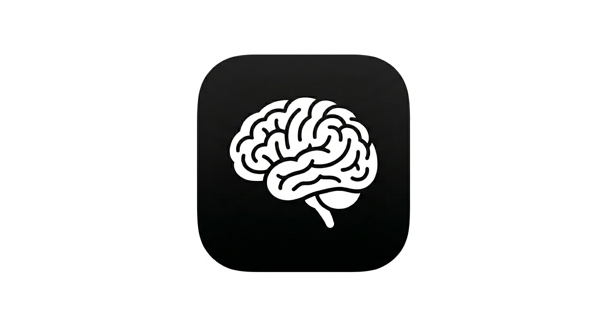

<p align="center">
  
</p>

# Synapse

**Synapse v1.0** – A lightweight neural network library in Python for learning and prediction, designed for simplicity and rapid prototyping.

---

## Features

- Fully **customizable neural network**
- Supports **sigmoid**, **linear** and **ReLU** activation functions  
- **Automatic normalization** of inputs and outputs
- Easy-to-use **train** and **predict** methods  
- Lightweight, dependency only on **NumPy** and **tqdm**  
- Designed for educational purposes and small projects  

---

## Installation

```bash
# Setup virtual environment and install dependencies
make setupEnvironment

# Activate the virtual environment
source .venv/bin/activate
```

---

## Documentation

### Quick Usage

```python
import synapse
import numpy

# numbers from 0 to 9 (x) and their double (y)
x = numpy.array([[0],[1],[2],[3],[4],[5],[6],[7],[8],[9]])
y = numpy.array([[0],[2],[4],[6],[8],[10],[12],[14],[16],[18]])

# Create neural network
net = synapse.NeuralNetwork(
    layers=[1,3,1],
    activation="linear",
    lr=0.001,
    normalize=True,
    task='regression'
)

# Train
net.train(x, y, iterations=100000)

# Predict
result = net.forward([10])
print(result)
```

---

## Core API

### NeuralNetwork

#### Initialization

```python
NeuralNetwork(layers, activation='sigmoid', lr=0.001, normalize=True, task='regression')
```

**Parameters:**

- `layers` : list  
  Network architecture (example: `[1, 3, 1]`)
- `activation` : str  
  `"sigmoid"`, `"relu"` or `"linear"`
- `lr` : float  
  Learning rate
- `normalize` : bool  
  Enable automatic normalization
- `task` : str  
  `"regression"` or `"binaryClassification"`

---

### Training

```python
net.train(x, y, iterations=5000)
```

**Description:**

- Trains the model using gradient descent  
- Displays live loss using `tqdm`

**Parameters:**

- `x` : input data  
- `y` : target values  
- `iterations` : number of training steps  

---

### Prediction

```python
net.forward(x)
```

**Description:**

- Runs inference on input data  
- Automatically handles normalization and denormalization  

---

## Model Persistence

### Save model

```python
net.save("model.npy")
```

Saves:

- weights  
- biases  
- architecture  
- normalization parameters  

---

### Load model

```python
net = synapse.NeuralNetwork.load("model.npy")
```

Loads a fully functional trained model.

---

## Internal Methods (Advanced)

### Forward propagation

```python
net.forwardInternal(x)
```

- Internal forward pass  
- Used during training  

---

### Backpropagation

```python
net.backward(x, y, output)
```

- Updates weights using gradients  
- Uses MSE or log loss depending on task  

---

## Activation Functions

### Sigmoid

```python
net.sigmoid(x)
```

### ReLU

```python
net.ReLU(x)
```

### Derivatives

```python
net.derivedSigmoid(x)
net.derivedReLU(x)
```

---

## Normalization

### Normalize

```python
net.normalize(x, xMin, xMax)
```

### Denormalize

```python
net.denormalize(xNorm, xMin, xMax)
```

---

## Utilities

### Version display

```python
synapse.showVersion()
```

Displays:

- ASCII logo  
- Current version  

---

## Example: Binary Classification

```python
import synapse
import numpy as np

x = np.array([[0],[1],[2],[3]])
y = np.array([[0],[0],[1],[1]])

net = synapse.NeuralNetwork(
    layers=[1,4,1],
    activation="relu",
    lr=0.01,
    task="binaryClassification"
)

net.train(x, y, iterations=5000)

print(net.forward([1.5]))
```

---

## Notes

- Ideal for learning neural networks  
- Not optimized for production (no GPU, no batching)  
- Supports:
  - Regression  
  - Binary classification  

---

## License

This project is licensed under the GNU General Public License v3.0.